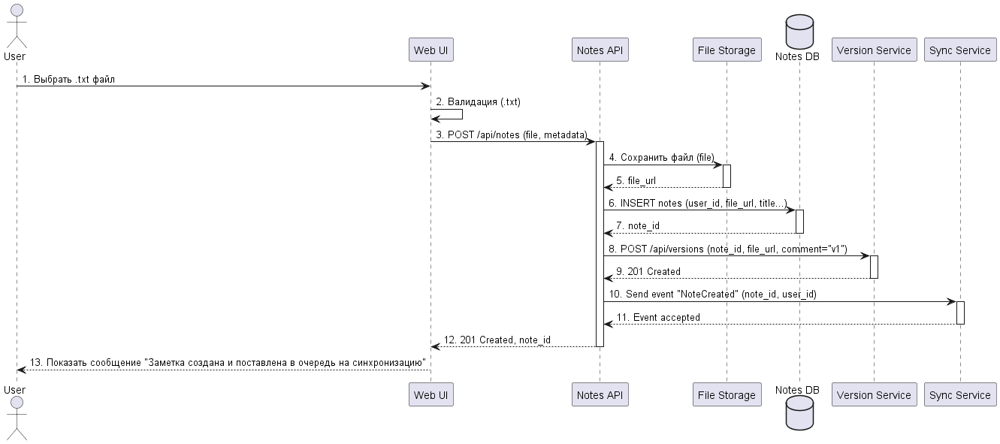
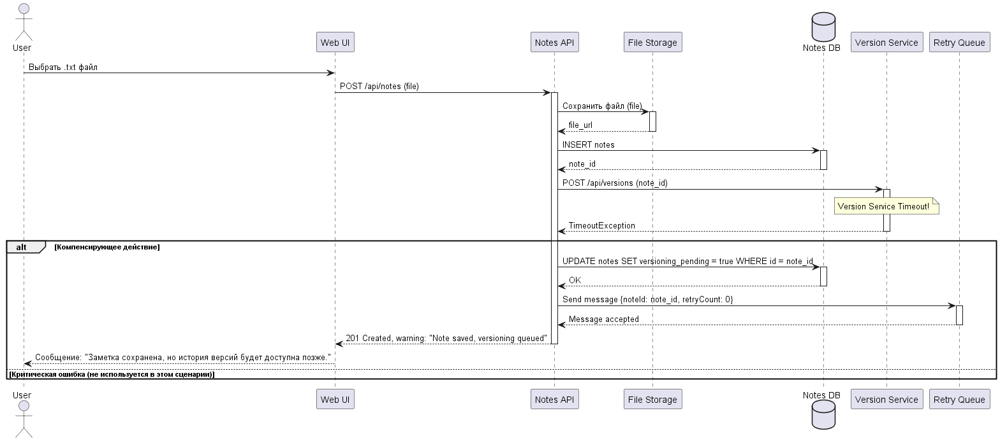
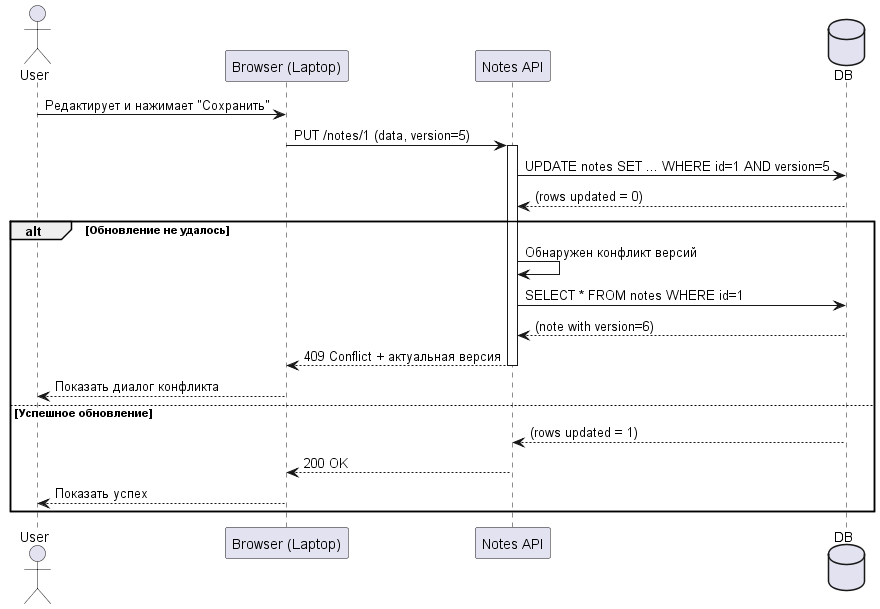

# Отчет по лабораторной работе №1
## Анализ требований и проектирование транзакционных границ

**Название проекта:** Notes Sync (Синхронизированные заметки)
**Вариант:** 42
**Студент:** Бондарчук Александр Юрьевич
**Группа:** ПО-13
**Дата:** 2026-03-08

---

### 1. Use-case описание

Основной сценарий, выбранный для анализа: **Создание новой заметки с локального текстового файла**.

Полное описание use-case представлено в файле [`use-case.md`](use-case.md).

**Критерии оценки:**
- [x] Акторы определены корректно (пользователь, система, файловая система).
- [x] Предусловия описаны.
- [x] Основной поток (Happy Path) детализирован.
- [x] Альтернативные потоки учтены.
- [x] Исключительные ситуации описаны.

---

### 2. Диаграммы последовательности (Sequence Diagrams)

#### 2.1 Happy Path: Успешное создание заметки из файла

На диаграмме показан процесс, когда пользователь загружает `.txt` файл, система сохраняет его, создаёт версию и уведомляет другие устройства о синхронизации.



*   [Ссылка на исходный код PlantUML (Happy Path)](diagrams/sequence-happy.puml)

#### 2.2 Error Case: Ошибка версионирования при создании заметки

На диаграмме показана ситуация, когда заметка успешно сохранена, но сервис версионирования временно недоступен. Система применяет компенсирующее действие, чтобы не потерять изменения пользователя, но и не нарушить целостность данных.



*   [Ссылка на исходный код PlantUML (Error Case)](diagrams/sequence-error-versioning.puml)

**Критерии оценки:**
- [x] Корректность нотации UML (акторы, участники, стрелки, activate/deactivate).
- [x] Включены все ключевые компоненты (UI, API, File Service, Version Service, Sync Service, DB, Local FS).
- [x] Показан сценарий с ошибкой и компенсацией.

---


### 2.3 Сценарий: Одновременное редактирование заметки с двух устройств



*Исходный код диаграммы:* [diagrams/optimistic-locking.puml](diagrams/optimistic-locking.puml)

**Описание сценария:**
1. Пользователь открывает заметку на двух устройствах
2. На телефоне сохраняет изменения (версия повышается до 6)
3. На ноутбуке пытается сохранить свои изменения, но отправляет старую версию (5)
4. Сервер обнаруживает конфликт и возвращает ошибку 409
5. Пользователь получает уведомление о конфликте и актуальную версию заметки

**Решение:** Оптимистичная блокировка через поле version в БД

### 3. Gherkin-сценарии

Файл с feature-сценариями: [`scenarios.feature`](scenarios.feature)

```gherkin
# scenarios.feature
Feature: Создание и синхронизация заметок
  Как пользователь Notes Sync
  Я хочу создавать заметки из txt-файлов и видеть их на всех устройствах
  Чтобы мои записи были всегда под рукой

  Scenario: 1. Успешное создание заметки из файла (Happy Path)
    Given пользователь "alice@example.com" авторизован в системе
    And у пользователя есть устройство "Phone" и "PC"
    When пользователь выбирает локальный файл "/documents/ideas.txt" для загрузки
    And система успешно загружает файл
    Then система сохраняет заметку с заголовком "ideas" в базе данных
    And система создает запись версии "v1" для этой заметки
    And система отправляет команду на синхронизацию для устройств пользователя
    And пользователь видит сообщение "Заметка 'ideas' успешно создана и поставлена в очередь на синхронизацию"

  Scenario: 2. Ошибка: Загружаемый файл имеет недопустимый формат
    Given пользователь авторизован в системе
    When пользователь пытается загрузить файл "image.png"
    Then система проверяет расширение файла
    And система отклоняет загрузку с ошибкой "Недопустимый тип файла. Разрешены только .txt"
    And пользователь видит сообщение об ошибке "Можно загружать только текстовые файлы"

  Scenario: 3. Ошибка: Сервис версионирования недоступен (требуется компенсация)
    Given пользователь авторизован в системе
    And сервис управления версиями (Version Service) не отвечает
    When пользователь успешно загружает файл "список_дел.txt"
    Then система сохраняет заметку в базе данных
    But при попытке создать версию возникает ошибка таймаута
    And система откатывает создание версии (помечает версию как "failed" или сохраняет событие для повторной попытки)
    And система помечает заметку как "требуется повторная попытка версионирования"
    And пользователь видит предупреждение "Заметка сохранена, но история версий временно недоступна. Мы попробуем создать её позже."

  Scenario: 4. Ошибка: Конфликт версий при синхронизации
    Given пользователь авторизован на устройстве "Phone" и "PC"
    And на устройстве "Phone" пользователь офлайн отредактировал заметку "Заметка_1"
    And на устройстве "PC" пользователь офлайн отредактировал ту же заметку "Заметка_1"
    When оба устройства выходят в онлайн и отправляют изменения на сервер
    Then сервер синхронизации обнаруживает конфликт версий
    And сервер сохраняет обе версии как "конфликтующие"
    And пользователь на обоих устройствах получает уведомление "Обнаружен конфликт в заметке 'Заметка_1'. Требуется ручное разрешение."