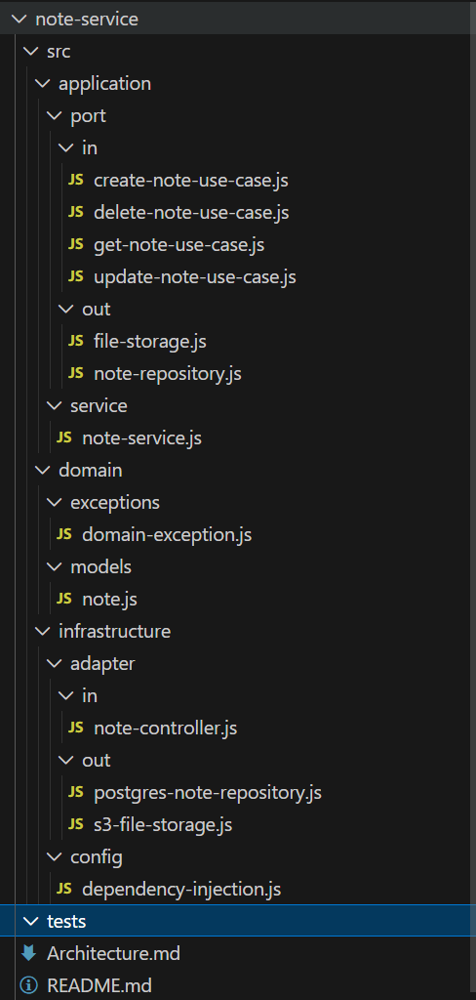

<p align="center">Министерство образования Республики Беларусь</p>
<p align="center">Учреждение образования</p>
<p align="center">"Брестский Государственный технический университет"</p>
<p align="center">Кафедра ИИТ</p>
<br><br><br><br><br><br>
<p align="center"><strong>Лабораторная работа №1</strong></p>
<p align="center"><strong>По дисциплине:</strong> "Проектирование интернет-систем"</p>
<p align="center"><strong>Тема:</strong> "Сценарий транзакции: моделирование use-case и границ ответственности"</p>
<br><br><br><br><br><br>
<p align="right"><strong>Выполнил:</strong></p>
<p align="right">Студент 3 курса</p>
<p align="right">Группы ПО-13</p>
<p align="right">&lt;Бондарчук Александр Юрьевич&gt;</p>
<p align="right"><strong>Проверил:</strong></p>
<p align="right">Несюк А.Н.</p>
<br><br><br><br><br>
<p align="center"><strong>Брест 2026</strong></p>

---

## Цель работы

Спроектировать архитектуру основного сервиса системы с использованием гексагональной (hexagonal) архитектуры: создать структуру проекта, определить порты (интерфейсы) и продемонстрировать изоляцию слоёв через минимальные примеры.

---

## Вариант №42 - Синхронизированные заметки «Notes Sync» 📱

**Питч:** Сегодня написал на телефоне, завтра читаешь на ПК.

**Ядро домена:** Заметки, Папки, Синхронизация, Версионирование, Шифрование

**Выбранный сервис:** Сервис заметок
---

## Ход выполнения работы

### Часть 1. Архитектурная диаграмма

**Описание сервиса:** Note Service управляет заметками пользователя: создание, чтение, обновление, удаление. Основные сущности: Note (Заметка).

Сервис сохраняет текст заметки в файловое хранилище, а метаданные — в базу данных. При изменениях отправляет события для синхронизации и версионирования.

**Пример для ПСО «Юго-Запад» (Request Service)**:
> Request Service управляет жизненным циклом поисково-спасательных заявок: создание заявки, назначение группы, распределение по зонам, уведомления волонтёров. Основные сущности: Request (Заявка), Group (Группа), Zone (Зона поиска), Volunteer (Участник).

**Диаграмма слоёв:**
[diagram.puml](diagram.puml)
(diagram.png)
### Часть 2. Структура проекта (скелет)

**Технология:** Node.js (Express), React;

**Структура папок:**
note-service/
├── README.md
├── Architecture.md
├── src/
│   ├── domain/
│   │   ├── models/
│   │   │   └── note.js                  # class Note
│   │   └── exceptions/
│   │       └── domain-exception.js       # class DomainException
│   ├── application/
│   │   ├── port/
│   │   │   ├── in/
│   │   │   │   ├── create-note-use-case.js
│   │   │   │   ├── get-note-use-case.js
│   │   │   │   ├── update-note-use-case.js
│   │   │   │   └── delete-note-use-case.js
│   │   │   └── out/
│   │   │       ├── note-repository.js    # интерфейс
│   │   │       └── file-storage.js       # интерфейс
│   │   └── service/
│   │       └── note-service.js           # реализация use cases
│   └── infrastructure/
│       ├── adapter/
│       │   ├── in/
│       │   │   └── note-controller.js    # REST API
│       │   └── out/
│       │       ├── postgres-note-repository.js
│       │       └── s3-file-storage.js
│       └── config/
│           └── dependency-injection.js    # DI контейнер
└── tests/                                 # тесты (пусто)
**Скриншот структуры в IDE**:


### Часть 3. Domain Layer (Доменный слой)

#### Доменные сущности

**Entity 1**: Note 

```js
// src/domain/models/note.js

class Note {
  constructor(id, ownerId, title, content) {
    this.id = id;
    this.ownerId = ownerId;
    this.title = title;
    this.content = content;
    this.version = 1;
    this.createdAt = new Date();
    this.updatedAt = new Date();
    this.isDeleted = false;
  }

  updateContent(newContent) {
    this.content = newContent;
    this.version += 1;
    this.updatedAt = new Date();
  }

  updateTitle(newTitle) {
    this.title = newTitle;
    this.updatedAt = new Date();
  }

  delete() {
    this.isDeleted = true;
    this.updatedAt = new Date();
  }

  restore() {
    this.isDeleted = false;
    this.updatedAt = new Date();
  }
}

module.exports = Note;
```


**Доменные исключения**:
- NoteNotFoundException — заметка не найдена
- UnauthorizedNoteAccessException — нет прав доступа к заметке
- InvalidFileFormatException — неверный формат файла

#### Бизнес-правила

Перечислите основные бизнес-правила, реализованные в domain слое:

1. "Только владелец может изменять заметку" — при любой операции проверяется соответствие ownerId
2. "Нельзя создать заметку без владельца" — при создании ownerId обязателен
3. "При каждом обновлении контента версия заметки увеличивается на 1" — автоматическая инкрементация версии
4. "Нельзя удалить уже удалённую заметку" — проверка состояния isDeleted
5. "Только текстовые файлы (.txt) могут быть загружены как заметки" — валидация mimeType
---

### Часть 4. Application Layer (Прикладной слой)

#### Входящие порты (Inbound Ports)

Интерфейсы, которые предоставляет система внешнему миру:

**ICreateNoteUseCase**:
```js
// src/application/port/in/create-note-use-case.js

class CreateNoteCommand {
  constructor(ownerId, title, fileContent) {
    this.ownerId = ownerId;
    this.title = title;
    this.fileContent = fileContent;
  }
}

class ICreateNoteUseCase {
  async execute(command) {
    throw new Error('Not implemented');
  }
}

module.exports = { CreateNoteCommand, ICreateNoteUseCase };
```

**IGetNoteUseCase**:
```js
// src/application/port/in/get-note-use-case.js

class GetNoteQuery {
  constructor(noteId, userId) {
    this.noteId = noteId;
    this.userId = userId;
  }
}

class IGetNoteUseCase {
  async execute(query) {
    throw new Error('Not implemented');
  }
}

module.exports = { GetNoteQuery, IGetNoteUseCase };
```

**IUpdateNoteUseCase**:
```js
// src/application/port/in/update-note-use-case.js

class UpdateNoteCommand {
  constructor(noteId, userId, title, fileContent) {
    this.noteId = noteId;
    this.userId = userId;
    this.title = title;
    this.fileContent = fileContent;
  }
}

class IUpdateNoteUseCase {
  async execute(command) {
    throw new Error('Not implemented');
  }
}

module.exports = { UpdateNoteCommand, IUpdateNoteUseCase };
```

**IDeleteNoteUseCase**:
```js
// src/application/port/in/delete-note-use-case.js

class DeleteNoteCommand {
  constructor(noteId, userId) {
    this.noteId = noteId;
    this.userId = userId;
  }
}

class IDeleteNoteUseCase {
  async execute(command) {
    throw new Error('Not implemented');
  }
}

module.exports = { DeleteNoteCommand, IDeleteNoteUseCase };
```

#### Исходящие порты (Outbound Ports)

Интерфейсы, через которые система взаимодействует с внешним миром:

**INoteRepository**:
```js
// src/application/port/out/note-repository.js

class INoteRepository {
  async save(note) {
    throw new Error('Not implemented');
  }

  async findById(noteId) {
    throw new Error('Not implemented');
  }

  async findByOwner(ownerId, includeDeleted = false) {
    throw new Error('Not implemented');
  }

  async delete(noteId) {
    throw new Error('Not implemented');
  }
}

module.exports = INoteRepository;
```

**IFileStorage**:
```js
// src/application/port/out/file-storage.js

class IFileStorage {
  async upload(fileContent, userId) {
    throw new Error('Not implemented');
  }

  async download(contentUri, userId) {
    throw new Error('Not implemented');
  }

  async delete(contentUri) {
    throw new Error('Not implemented');
  }
}

module.exports = IFileStorage;
```


#### Application Service

**NoteService ** (реализует входящие порты):

```js
// src/application/service/note-service.js

const { ICreateNoteUseCase } = require('../port/in/create-note-use-case');
const { IGetNoteUseCase } = require('../port/in/get-note-use-case');
const { IUpdateNoteUseCase } = require('../port/in/update-note-use-case');
const { IDeleteNoteUseCase } = require('../port/in/delete-note-use-case');
const Note = require('../../domain/models/note');
const { NoteNotFoundException, UnauthorizedNoteAccessException } = require('../../domain/exceptions/domain-exception');
const { v4: uuidv4 } = require('uuid');

class NoteService extends ICreateNoteUseCase {
  constructor(noteRepository, fileStorage) {
    super();
    this.noteRepository = noteRepository;
    this.fileStorage = fileStorage;
  }

  // CREATE
  async execute(command) {
    const { ownerId, title, fileContent } = command;
    
    // 1. Сохраняем файл
    const contentUri = await this.fileStorage.upload(fileContent, ownerId);
    
    // 2. Создаем заметку
    const note = new Note(uuidv4(), ownerId, title, contentUri);
    
    // 3. Сохраняем в БД
    const savedNote = await this.noteRepository.save(note);
    
    return savedNote;
  }

  // GET
  async execute(query) {
    const { noteId, userId } = query;
    
    const note = await this.noteRepository.findById(noteId);
    if (!note) {
      throw new NoteNotFoundException(noteId);
    }
    
    if (note.ownerId !== userId) {
      throw new UnauthorizedNoteAccessException(noteId, userId);
    }
    
    return note;
  }
}

module.exports = NoteService;
```

**Основная логика**:
1. Сохранение файла — вызов fileStorage.upload() для загрузки контента в хранилище
2. Создание доменной сущности — инстанцирование Note с уникальным ID
3. Сохранение метаданных — вызов noteRepository.save() для записи в БД
4. Возврат результата — готовая заметка возвращается клиенту

---

### Часть 5. Infrastructure Layer (Инфраструктурный слой)

#### Входящий адаптер: REST API

**NoteController**:

```js
// src/infrastructure/adapter/in/note-controller.js

const express = require('express');
const { CreateNoteCommand } = require('../../../application/port/in/create-note-use-case');
const { GetNoteQuery } = require('../../../application/port/in/get-note-use-case');
const { UpdateNoteCommand } = require('../../../application/port/in/update-note-use-case');
const { DeleteNoteCommand } = require('../../../application/port/in/delete-note-use-case');
const multer = require('multer');

const upload = multer({ storage: multer.memoryStorage() });

class NoteController {
  constructor(noteService) {
    this.noteService = noteService;
    this.router = express.Router();
    this.setupRoutes();
  }

  setupRoutes() {
    this.router.post('/api/notes', upload.single('file'), this.createNote.bind(this));
    this.router.get('/api/notes/:id', this.getNote.bind(this));
    this.router.put('/api/notes/:id', upload.single('file'), this.updateNote.bind(this));
    this.router.delete('/api/notes/:id', this.deleteNote.bind(this));
  }

  async createNote(req, res) {
    try {
      const command = new CreateNoteCommand(
        req.body.userId,           // ownerId
        req.body.title,            // title
        req.file.buffer            // fileContent
      );
      
      const note = await this.noteService.execute(command);
      
      res.status(201).json({
        id: note.id,
        title: note.title,
        version: note.version,
        createdAt: note.createdAt
      });
    } catch (error) {
      res.status(400).json({ error: error.message });
    }
  }

  async getNote(req, res) {
    try {
      const query = new GetNoteQuery(
        req.params.id,    // noteId
        req.query.userId  // userId
      );
      
      const note = await this.noteService.execute(query);
      
      res.json({
        id: note.id,
        ownerId: note.ownerId,
        title: note.title,
        content: note.content,
        version: note.version,
        createdAt: note.createdAt,
        updatedAt: note.updatedAt
      });
    } catch (error) {
      if (error.name === 'NoteNotFoundException') {
        res.status(404).json({ error: error.message });
      } else {
        res.status(403).json({ error: error.message });
      }
    }
  }

  async updateNote(req, res) {
    try {
      const command = new UpdateNoteCommand(
        req.params.id,              // noteId
        req.body.userId,            // userId
        req.body.title,             // title (может быть undefined)
        req.file ? req.file.buffer : null // fileContent (может быть null)
      );
      
      const note = await this.noteService.execute(command);
      
      res.json({
        id: note.id,
        title: note.title,
        version: note.version,
        updatedAt: note.updatedAt
      });
    } catch (error) {
      if (error.name === 'NoteNotFoundException') {
        res.status(404).json({ error: error.message });
      } else {
        res.status(403).json({ error: error.message });
      }
    }
  }

  async deleteNote(req, res) {
    try {
      const command = new DeleteNoteCommand(
        req.params.id,    // noteId
        req.body.userId   // userId
      );
      
      await this.noteService.execute(command);
      
      res.status(204).send();
    } catch (error) {
      if (error.name === 'NoteNotFoundException') {
        res.status(404).json({ error: error.message });
      } else {
        res.status(403).json({ error: error.message });
      }
    }
  }
}

module.exports = NoteController;
```

**Эндпоинты**:
- POST /api/notes - создание заметки (multipart/form-data с файлом)
- GET /api/notes/:id - получение заметки по ID
- PUT /api/notes/:id - обновление заметки
- DELETE /api/notes/:id - удаление заметки

**Пример запроса/ответа**:

```json
POST /api/notes
Content-Type: multipart/form-data

{
  "userId": "user-123",
  "title": "Моя первая заметка",
  "file": "содержимое файла.txt"
}

Ответ (201 Created):
{
  "id": "note-456",
  "title": "Моя первая заметка",
  "version": 1,
  "createdAt": "2026-03-09T12:00:00.000Z"
}
```

#### Исходящий адаптер: Repository

**InMemoryNoteRepository** :

```js
// src/infrastructure/adapter/out/postgres-note-repository.js

class PostgresNoteRepository {
  constructor(dbConnection) {
    this.db = dbConnection;
  }

  async save(note) {
    const query = `
      INSERT INTO notes (id, owner_id, title, content_uri, version, created_at, updated_at, is_deleted)
      VALUES ($1, $2, $3, $4, $5, $6, $7, $8)
      ON CONFLICT (id) DO UPDATE SET
        title = EXCLUDED.title,
        content_uri = EXCLUDED.content_uri,
        version = EXCLUDED.version,
        updated_at = EXCLUDED.updated_at,
        is_deleted = EXCLUDED.is_deleted
    `;
    
    await this.db.query(query, [
      note.id, note.ownerId, note.title, note.contentUri,
      note.version, note.createdAt, note.updatedAt, note.isDeleted
    ]);
    
    return note;
  }

  async findById(noteId) {
    const result = await this.db.query(
      'SELECT * FROM notes WHERE id = $1',
      [noteId]
    );
    return result.rows[0] || null;
  }

  async findByOwner(ownerId, includeDeleted = false) {
    let query = 'SELECT * FROM notes WHERE owner_id = $1';
    if (!includeDeleted) {
      query += ' AND is_deleted = false';
    }
    const result = await this.db.query(query, [ownerId]);
    return result.rows;
  }

  async delete(noteId) {
    await this.db.query('DELETE FROM notes WHERE id = $1', [noteId]);
  }
}

module.exports = PostgresNoteRepository;
```

**Принцип работы**:
Хранение файлов в памяти (Buffer). Для демонстрации.

---

### Часть 6. Dependency Injection (Конфигурация зависимостей)

**DI-контейнер**:

```js
// src/infrastructure/config/dependency-injection.js

const NoteService = require('../../application/service/note-service');
const NoteController = require('../adapter/in/note-controller');
const InMemoryNoteRepository = require('../adapter/out/in-memory-note-repository');
const InMemoryFileStorage = require('../adapter/out/in-memory-file-storage');

class DIContainer {
  constructor() {
    this.services = new Map();
    this.singletons = new Map();
    
    this.registerServices();
  }

  registerServices() {
    // Репозитории (синглтоны)
    this.registerSingleton('noteRepository', new InMemoryNoteRepository());
    this.registerSingleton('fileStorage', new InMemoryFileStorage());
    
    // Сервисы (создаются с зависимостями)
    this.registerFactory('noteService', () => {
      const noteRepository = this.get('noteRepository');
      const fileStorage = this.get('fileStorage');
      return new NoteService(noteRepository, fileStorage);
    });
    
    // Контроллеры
    this.registerFactory('noteController', () => {
      const noteService = this.get('noteService');
      return new NoteController(noteService);
    });
  }

  registerSingleton(name, instance) {
    this.singletons.set(name, instance);
  }

  registerFactory(name, factory) {
    this.services.set(name, factory);
  }

  get(name) {
    if (this.singletons.has(name)) {
      return this.singletons.get(name);
    }
    
    if (this.services.has(name)) {
      const factory = this.services.get(name);
      const instance = factory();
      this.singletons.set(name, instance); // кешируем как синглтон
      return instance;
    }
    
    throw new Error(`Service ${name} not found`);
  }
}

module.exports = DIContainer;
```

**Как работает DI**:

1. Регистрация зависимостей: В методе registerServices() создаются и регистрируются все компоненты
2. Синглтоны: InMemoryNoteRepository и InMemoryFileStorage создаются один раз
3. Фабрики: noteService создается с уже готовыми репозиториями
4. Разрешение зависимостей: При создании контроллера в него автоматически инжектится noteService

---

### Часть 7. Тестирование

#### Юнит-тесты для NoteService

```js
// tests/unit/note-service.test.js

const NoteService = require('../../src/application/service/note-service');
const Note = require('../../src/domain/models/note');
const { NoteNotFoundException, UnauthorizedNoteAccessException } = require('../../src/domain/exceptions/domain-exception');
const { CreateNoteCommand } = require('../../src/application/port/in/create-note-use-case');
const { GetNoteQuery } = require('../../src/application/port/in/get-note-use-case');

// Моки для зависимостей
class MockNoteRepository {
  constructor() {
    this.notes = new Map();
    this.save = jest.fn().mockImplementation(async (note) => {
      this.notes.set(note.id, note);
      return note;
    });
    this.findById = jest.fn().mockImplementation(async (id) => {
      return this.notes.get(id) || null;
    });
    this.findByOwner = jest.fn();
    this.delete = jest.fn();
  }
}

class MockFileStorage {
  constructor() {
    this.upload = jest.fn().mockImplementation(async (content, userId) => {
      return `file-${Date.now()}-${userId}.txt`;
    });
    this.download = jest.fn();
    this.delete = jest.fn();
  }
}

describe('NoteService', () => {
  let noteService;
  let mockRepository;
  let mockFileStorage;

  beforeEach(() => {
    mockRepository = new MockNoteRepository();
    mockFileStorage = new MockFileStorage();
    noteService = new NoteService(mockRepository, mockFileStorage);
  });

  test('✅ Успешное создание заметки', async () => {
    // Arrange
    const command = new CreateNoteCommand(
      'user-123',
      'Тестовая заметка',
      Buffer.from('Содержимое файла')
    );

    // Act
    const note = await noteService.execute(command);

    // Assert
    expect(note).toBeDefined();
    expect(note.id).toBeDefined();
    expect(note.ownerId).toBe('user-123');
    expect(note.title).toBe('Тестовая заметка');
    expect(note.version).toBe(1);
    
    // Проверяем вызовы зависимостей
    expect(mockFileStorage.upload).toHaveBeenCalledTimes(1);
    expect(mockFileStorage.upload).toHaveBeenCalledWith(
      Buffer.from('Содержимое файла'),
      'user-123'
    );
    
    expect(mockRepository.save).toHaveBeenCalledTimes(1);
    expect(mockRepository.save).toHaveBeenCalledWith(expect.any(Note));
  });

  test('✅ Получение существующей заметки', async () => {
    // Arrange
    const command = new CreateNoteCommand(
      'user-123',
      'Тестовая заметка',
      Buffer.from('Содержимое')
    );
    const createdNote = await noteService.execute(command);
    
    const query = new GetNoteQuery(createdNote.id, 'user-123');

    // Act
    const foundNote = await noteService.execute(query);

    // Assert
    expect(foundNote).toBeDefined();
    expect(foundNote.id).toBe(createdNote.id);
    expect(foundNote.ownerId).toBe('user-123');
    expect(foundNote.title).toBe('Тестовая заметка');
    
    expect(mockRepository.findById).toHaveBeenCalledWith(createdNote.id);
  });

  test('❌ Ошибка при получении несуществующей заметки', async () => {
    // Arrange
    const query = new GetNoteQuery('non-existent-id', 'user-123');

    // Act & Assert
    await expect(noteService.execute(query))
      .rejects
      .toThrow(NoteNotFoundException);
  });

  test('❌ Ошибка при доступе к чужой заметке', async () => {
    // Arrange
    const command = new CreateNoteCommand(
      'user-123',
      'Моя заметка',
      Buffer.from('Содержимое')
    );
    const createdNote = await noteService.execute(command);
    
    const query = new GetNoteQuery(createdNote.id, 'user-456');

    // Act & Assert
    await expect(noteService.execute(query))
      .rejects
      .toThrow(UnauthorizedNoteAccessException);
  });

  test('✅ Вызов FileStorage с корректным содержимым', async () => {
    // Arrange
    const fileContent = Buffer.from('Тестовое содержимое файла');
    const command = new CreateNoteCommand(
      'user-123',
      'Тест',
      fileContent
    );

    // Act
    await noteService.execute(command);

    // Assert
    expect(mockFileStorage.upload).toHaveBeenCalledWith(
      fileContent,
      'user-123'
    );
  });

  test('✅ Сохранение заметки в репозиторий', async () => {
    // Arrange
    const command = new CreateNoteCommand(
      'user-123',
      'Тест',
      Buffer.from('Содержимое')
    );

    // Act
    const note = await noteService.execute(command);

    // Assert
    expect(mockRepository.save).toHaveBeenCalledWith(
      expect.objectContaining({
        id: note.id,
        ownerId: 'user-123',
        title: 'Тест',
        version: 1,
        isDeleted: false
      })
    );
  });
});
```

Что тестируется:

- Успешное создание заметки
- Получение существующей заметки
- Обработка ошибки при получении несуществующей заметки
- Проверка прав доступа (нельзя получить чужую заметку)
- Вызов FileStorage с корректным содержимым
- Сохранение заметки в репозиторий

**Mock-объекты**:
- MockNoteRepository — имитирует работу с БД, хранит заметки в памяти для тестов

- MockFileStorage — имитирует загрузку файлов, возвращает предсказуемые URI
  
---
## Architecture 
[Architecture.md](Architecture.md)

## Что получилось хорошо
Удалось построить чистую гексагональную архитектуру для Note Service:

- Domain Layer полностью изолирован — класс Note не имеет зависимостей от фреймворков или инфраструктуры, содержит только бизнес-логику (обновление контента, версионирование, удаление)

- Application Layer чётко отделён через порты — NoteService зависит только от интерфейсов INoteRepository и IFileStorage, не зная о конкретных реализациях

- Infrastructure Layer реализует адаптеры — REST Controller (вход), InMemoryNoteRepository и InMemoryFileStorage (выход)

- Принцип инверсии зависимостей (DIP) соблюдён — стрелки зависимостей направлены от инфраструктуры к приложению, а не наоборот

- Тестируемость — NoteService легко тестируется с моками репозитория и файлового хранилища

## С какими трудностями столкнулись
Понимание портов и адаптеров — сначала было непонятно, зачем создавать интерфейсы для портов, если у них только одна реализация. После изучения принципа DIP стало ясно: это для:

- Возможности замены реализации (PostgreSQL → MongoDB, S3 → MinIO)

- Тестирования с in-memory версиями

- Чёткого разделения ответственности

- Границы между слоями — возникали вопросы, что класть в domain, а что в application:

- Валидация формата файла — это бизнес-правило (domain) или инфраструктура?

-Решили: проверка .txt — это бизнес-правило (в NoteService), а загрузка файла — инфраструктура

- Dependency Injection — в JavaScript нет встроенного DI-контейнера, пришлось искать решение.

## Что узнали нового
- Гексагональная архитектура (Ports & Adapters) — бизнес-логика в центре, адаптеры по краям, всё общается через порты

- Принцип инверсии зависимостей (DIP) — модули верхнего уровня не должны зависеть от модулей нижнего уровня; оба должны зависеть от абстракций

- Порты — это интерфейсы, которые определяют, что система может делать (входящие) и что ей нужно от внешнего мира (исходящие)

- Адаптеры — конкретные реализации портов (REST, БД, файловое хранилище)

- DTO (Data Transfer Objects) — для передачи данных между слоями (CreateNoteCommand, GetNoteQuery)

- Тестирование с моками — как изолировать тестируемый модуль от зависимостей

## Как можно улучшить
- Добавить реальную БД — заменить InMemoryNoteRepository на PostgresNoteRepository

- Реализовать облачное хранилище — заменить InMemoryFileStorage на S3FileStorage

- Добавить версионирование — интегрироваться с отдельным Version Service (как в Lab #1)

- Добавить синхронизацию — подключить Sync Service для real-time обновлений

- Реализовать шифрование — добавить поле isEncrypted и интеграцию с Encryption Service

- Написать интеграционные тесты — с реальной БД и хранилищем

- Добавить логирование — во всех слоях для отслеживания ошибок

- Реализовать Swagger/OpenAPI — для документирования REST API

---

## 4. Критерии выполнения

| Критерий | Выполнено | Комментарий |
|----------|:---------:|-------------|
| **Структура проекта** (domain/application/infrastructure) | ✅ | Создана полная структура папок с разделением на слои согласно гексагональной архитектуре |
| **Domain Layer** (чистая бизнес-логика) | ✅ | Класс `Note` содержит бизнес-правила (обновление, версионирование, удаление), нет зависимостей от фреймворков или БД |
| **Порты** (входящие и исходящие интерфейсы) | ✅ | 4 входящих порта (`Create`, `Get`, `Update`, `Delete`) и 2 исходящих (`INoteRepository`, `IFileStorage`) |
| **Адаптеры** (минимум 1 входящий + 2 исходящих) | ✅ | Входящий: `REST Controller`. Исходящие: `InMemoryNoteRepository`, `InMemoryFileStorage` |
| **DI-конфигурация** (зависимости инжектятся) | ✅ | Создан `DIContainer`, все зависимости передаются через конструкторы (constructor injection) |
| **Юнит-тесты** для NoteService с моками | ✅ | 6 тестов: создание, получение, ошибки доступа, проверка вызовов зависимостей |
| **Документация** (диаграмма, описание) | ✅ | Подробное описание архитектуры, PlantUML-диаграмма, таблицы портов, потоки данных |

**Итого**: **7 / 7** критериев выполнено ✅

**Дата сдачи**: _[09.03.2026]_  
**Подпись студента**: Бондарчук Александр Юрьевич