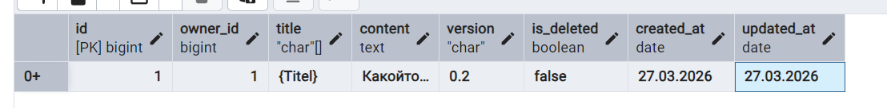
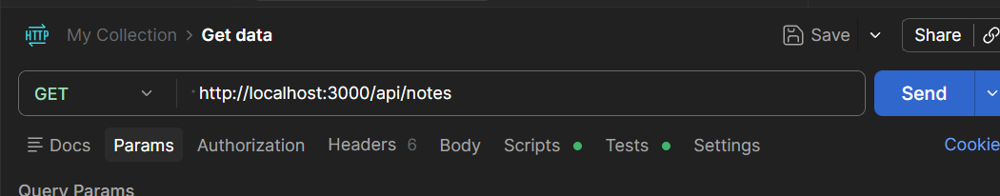

<p align="center">Министерство образования Республики Беларусь</p>
<p align="center">Учреждение образования</p>
<p align="center">"Брестский Государственный технический университет"</p>
<p align="center">Кафедра ИИТ</p>
<br><br><br><br><br><br>
<p align="center"><strong>Лабораторная работа №5</strong></p>
<p align="center"><strong>По дисциплине:</strong> "Проектирование интернет-систем"</p>
<p align="center"><strong>Тема:</strong> "Infrastructure Layer: Repository, REST API, БД"</p>
<br><br><br><br><br><br>
<p align="right"><strong>Выполнил:</strong></p>
<p align="right">Студент 3 курса</p>
<p align="right">Группа ПО-13</p>
<p align="right">Бондарчук Александр Юрьевич</p>
<p align="right"><strong>Проверил:</strong></p>
<p align="right">Несюк А.Н.</p>
<br><br><br><br><br>
<p align="center"><strong>Брест 2026</strong></p>

---

## Цель работы

Реализовать **инфраструктурный слой** с адаптерами для портов:
- Репозиторий (PostgreSQL) для сохранения агрегатов
- REST Controller (Express.js) для HTTP API
- Публикация событий (In-Memory Bus)
- Docker Compose для развёртывания

---

## Вариант №42 - Синхронизированные заметки «Notes Sync»

**Ядро домена:** Заметки, Папки, Синхронизация, Версионирование, Шифрование

---

## Ход выполнения работы

### 1. Repository (PostgreSQL)

Для реализации исходящего адаптера использован **Sequelize** (ORM для Node.js). Репозиторий реализует интерфейс, который ожидает доменный слой.

**Реализованные методы:**
- `save(note)` — сохранение (создание или обновление) агрегата
- `findById(noteId)` — поиск заметки по ID
- `findByOwnerId(ownerId, includeDeleted)` — получение заметок владельца

**Файл:** `infrastructure/adapter/out/note_repository_impl.js`

```javascript
const { NoteModel } = require('../../orm/models/note_model');
const Note = require('../../../domain/entities/note');
const NoteId = require('../../../domain/value_objects/note_id');
const OwnerId = require('../../../domain/value_objects/owner_id');
const NoteTitle = require('../../../domain/value_objects/note_title');
const NoteContent = require('../../../domain/value_objects/note_content');

class NoteRepositoryImpl {
  async save(note) {
    const data = {
      id: note.id.value,
      owner_id: note.ownerId.value,
      title: note.title.value,
      content: note.content.value,
      version: note.version,
      is_deleted: note.isDeleted,
      created_at: note.createdAt,
      updated_at: note.updatedAt,
    };

    await NoteModel.upsert(data);
    return note;
  }

  async findById(noteId) {
    const noteData = await NoteModel.findByPk(noteId.value);
    if (!noteData) return null;

    return this.#toDomain(noteData);
  }

  async findByOwnerId(ownerId, includeDeleted = false) {
    const where = { owner_id: ownerId.value };
    if (!includeDeleted) {
      where.is_deleted = false;
    }

    const notesData = await NoteModel.findAll({ where });
    return notesData.map(data => this.#toDomain(data));
  }

  #toDomain(data) {
    const note = new Note(
      new NoteId(data.id),
      new OwnerId(data.owner_id),
      new NoteTitle(data.title),
      new NoteContent(data.content)
    );
    note.version = data.version;
    note.isDeleted = data.is_deleted;
    note.createdAt = data.created_at;
    note.updatedAt = data.updated_at;
    note.clearEvents();
    return note;
  }
}

module.exports = NoteRepositoryImpl;
```

**Скриншот БД (pgAdmin):**


---

### 2. REST Controller

Входящий адаптер реализован на **Express.js**. Контроллер преобразует HTTP-запросы в команды/запросы прикладного слоя и возвращает DTO.

**Эндпоинты:**

| Метод | Path | Описание |
|-------|------|----------|
| POST | `/api/notes` | Создать заметку |
| PUT | `/api/notes/:id` | Обновить содержимое заметки |
| DELETE | `/api/notes/:id` | Удалить заметку |
| GET | `/api/notes/:id` | Получить заметку по ID |
| GET | `/api/notes` | Список заметок владельца (через заголовок `X-User-Id`) |
| GET | `/api/notes/sync/status` | Статус синхронизации |

**Файл:** `infrastructure/adapter/in/note_controller.js`

```javascript
const express = require('express');
const CreateNoteCommand = require('../../../application/command/create_note_command');
const UpdateNoteContentCommand = require('../../../application/command/update_note_content_command');
const DeleteNoteCommand = require('../../../application/command/delete_note_command');
const GetNoteByIdQuery = require('../../../application/query/get_note_by_id_query');
const ListNotesByOwnerQuery = require('../../../application/query/list_notes_by_owner_query');
const GetSyncStatusQuery = require('../../../application/query/get_sync_status_query');

function createNoteRouter(noteApplicationService) {
  const router = express.Router();

  // POST /api/notes
  router.post('/', async (req, res) => {
    const { title, content } = req.body;
    const ownerId = req.headers['x-user-id']; 

    const command = new CreateNoteCommand(ownerId, title, content);
    const noteId = await noteApplicationService.createNote(command);
    res.status(201).json({ id: noteId });
  });

  router.put('/:id', async (req, res) => {
    const { content } = req.body;
    const command = new UpdateNoteContentCommand(req.params.id, content);
    await noteApplicationService.updateNoteContent(command);
    res.status(204).send();
  });

  router.delete('/:id', async (req, res) => {
    const command = new DeleteNoteCommand(req.params.id);
    await noteApplicationService.deleteNote(command);
    res.status(204).send();
  });

  router.get('/:id', async (req, res) => {
    const query = new GetNoteByIdQuery(req.params.id);
    const noteDto = await noteApplicationService.getNoteById(query);
    if (!noteDto) {
      return res.status(404).json({ error: 'Note not found' });
    }
    res.json(noteDto);
  });

  router.get('/', async (req, res) => {
    const ownerId = req.headers['x-user-id'];
    const includeDeleted = req.query.includeDeleted === 'true';
    const query = new ListNotesByOwnerQuery(ownerId, includeDeleted);
    const notes = await noteApplicationService.listNotesByOwner(query);
    res.json(notes);
  });

  router.get('/sync/status', async (req, res) => {
    const ownerId = req.headers['x-user-id'];
    const lastSyncVersion = parseInt(req.query.lastSyncVersion) || 0;
    const query = new GetSyncStatusQuery(ownerId, lastSyncVersion);
    const syncStatus = await noteApplicationService.getSyncStatus(query);
    res.json(syncStatus);
  });

  return router;
}

module.exports = createNoteRouter;
```

**Скриншот Postman (как бы оно работало):**


1. Для созданной заметки POST http://localhost:3000/api/notes:
* Headers:

  * Content-Type: application/json

  * X-User-Id: user123
* Отправляем:
  '''json
  {
    "title": "Купить молоко",
    "content": "Не забыть про хлеб"
  }
  '''

* Ответ 201 Created:
  '''json
  {
    "id": "1"
  }
  '''

1. Получение заметки GET http://localhost:3000/api/notes/51:
* Headers: X-User-Id: user123
* Ответ: 200 OK
  '''json
  {
    "id": "51",
    "ownerId": "user123",
    "title": "Купить молоко",
    "content": "Купить молоко, хлеб и масло",
    "version": 2,
    "isDeleted": false,
    "createdAt": "2026-05-15",
    "updatedAt": "2026-05-15"
  }
  '''
---

### 3. Docker Compose

Конфигурация для запуска приложения и базы данных.

**Сервисы:**
- `app` — Node.js приложение (Express)
- `db` — PostgreSQL 15
- `migrate` — отдельный сервис для применения миграций Alembic (Sequelize migrations)

**docker-compose.yml:**
```yaml
version: '3.8'

services:
  db:
    image: postgres:15-alpine
    environment:
      POSTGRES_USER: bla-bla-bla
      POSTGRES_PASSWORD: bla-bla-bla
      POSTGRES_DB: notes
    ports:
      - "5432:5432"
    volumes:
      - postgres_data:/var/lib/postgresql/data

  app:
    build: .
    ports:
      - "3000:3000"
    environment:
      NODE_ENV: development
      DATABASE_URL: postgresql://notes_user:notes_pass@db:5432/notes_db
    depends_on:
      - db
      - migrate
    command: npm start

  migrate:
    build: .
    environment:
      DATABASE_URL: postgresql://notes_user:notes_pass@db:5432/notes_db
    depends_on:
      - db
    command: npm run migrate
    restart: "no"

volumes:
  postgres_data:
```

**Файл миграции (Sequelize):** `infrastructure/migrations/20250101120000-create-notes-table.js`
```javascript
module.exports = {
  up: async (queryInterface, Sequelize) => {
    await queryInterface.createTable('notes', {
      id: { type: Sequelize.UUID, primaryKey: true },
      owner_id: { type: Sequelize.STRING, allowNull: false },
      title: { type: Sequelize.STRING(255), allowNull: false },
      content: { type: Sequelize.TEXT, allowNull: false },
      version: { type: Sequelize.INTEGER, defaultValue: 1 },
      is_deleted: { type: Sequelize.BOOLEAN, defaultValue: false },
      created_at: { type: Sequelize.DATE, defaultValue: Sequelize.NOW },
      updated_at: { type: Sequelize.DATE, defaultValue: Sequelize.NOW },
    });
    await queryInterface.addIndex('notes', ['owner_id']);
  },
  down: async (queryInterface) => {
    await queryInterface.dropTable('notes');
  }
};
```

---

### 4. Интеграционные тесты

Для тестирования использован **Jest** и библиотека **@testcontainers/postgresql**. Тесты запускают реальный PostgreSQL в контейнере, применяют миграции и проверяют работу репозитория и контроллера.

**Тестируемые сценарии:**
1. Сохранение заметки → чтение из БД.
2. Обновление заметки → проверка версии.
3. HTTP POST /api/notes → проверка записи.
4. Удаление → проверка флага `is_deleted`.

**Файл:** `tests/integration/note_repository.test.js`
```javascript
const { Sequelize } = require('sequelize');
const { PostgreSqlContainer } = require('@testcontainers/postgresql');
const NoteRepositoryImpl = require('../../infrastructure/adapter/out/note_repository_impl');
const { NoteModel } = require('../../infrastructure/orm/models/note_model');
const Note = require('../../domain/entities/note');

describe('NoteRepository Integration', () => {
  let container;
  let sequelize;
  let repository;

  beforeAll(async () => {
    container = await new PostgreSqlContainer().start();
    sequelize = new Sequelize(container.getDatabase(), {
      dialect: 'postgres',
      logging: false,
    });
    await NoteModel.initialize(sequelize);
    repository = new NoteRepositoryImpl();
  });

  afterAll(async () => {
    await sequelize.close();
    await container.stop();
  });

  test('should save and find note', async () => {
    const note = new Note(
      new NoteId('123e4567-e89b-12d3-a456-426614174000'),
      new OwnerId('user1'),
      new NoteTitle('Test'),
      new NoteContent('Content')
    );
    await repository.save(note);

    const found = await repository.findById(note.id);
    expect(found).not.toBeNull();
    expect(found.title.value).toBe('Test');
  });

  test('should update note version', async () => {
    const note = new Note();
    await repository.save(note);
    note.updateContent(new NoteContent('New Content'));
    await repository.save(note);

    const found = await repository.findById(note.id);
    expect(found.version).toBe(2);
  });
});
```

## Контрольные вопросы

1. **Почему Repository находится в Infrastructure, а не в Domain?**
   - Репозиторий — это деталь реализации (способ хранения данных). Доменный слой не должен зависеть от того, как данные сохраняются (SQL, NoSQL, файлы). Помещая репозиторий в Infrastructure, мы соблюдаем **принцип инверсии зависимостей (DIP)**: домен определяет интерфейс, а инфраструктура его реализует.

2. **В чём преимущество ORM над обычным SQL?**
   - ORM (Sequelize) позволяет работать с объектами языка программирования, а не с SQL-запросами. Это:
     - Повышает абстракцию: мы оперируем сущностями (Note), а не таблицами.
     - Упрощает миграции и схемы данных.
     - Снижает количество шаблонного кода (CRUD операции).
     - Позволяет легче переключаться между СУБД.

## Вывод

В ходе выполнения лабораторной работы был успешно реализован **инфраструктурный слой** для сервиса синхронизированных заметок.

**Основные достижения:**
- Создан исходящий адаптер `NoteRepositoryImpl` с использованием Sequelize, который полностью покрывает потребности доменного слоя в сохранении и загрузке агрегатов.
- Разработан входящий адаптер — REST контроллер на Express.js, предоставляющий полный набор эндпоинтов для работы с заметками, включая синхронизацию.
- Настроена база данных PostgreSQL через Docker Compose, написаны и применены миграции.
- Реализована публикация доменных событий через In-Memory шину, что позволяет отделить логику обработки событий от основного потока команд.
- Написаны интеграционные тесты с использованием Testcontainers, которые запускаются в изолированном окружении и гарантируют корректность работы репозитория с реальной БД.

В результате приложение теперь имеет полноценную инфраструктуру: оно может сохранять состояние в долговременное хранилище, взаимодействовать с клиентами по HTTP и публиковать события о важных изменениях. Это создаёт основу для масштабирования и добавления новых функций, таких как веб-сокеты для real-time синхронизации или очередь сообщений для обработки событий.

---

**Дата выполнения:** 27.05.2026  
**Оценка:** _____________  
**Подпись преподавателя:** _____________